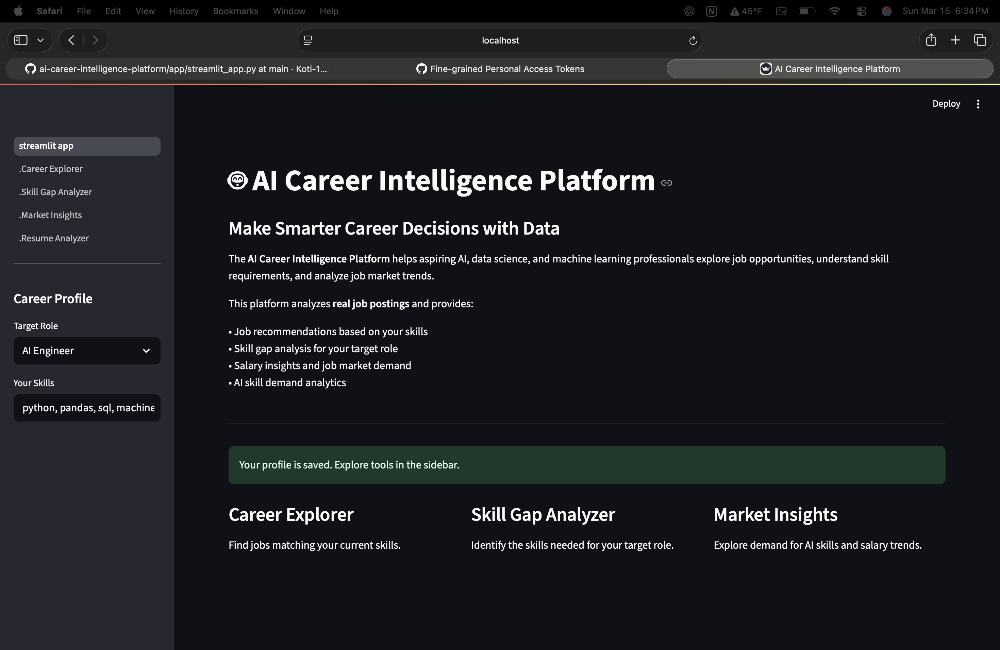
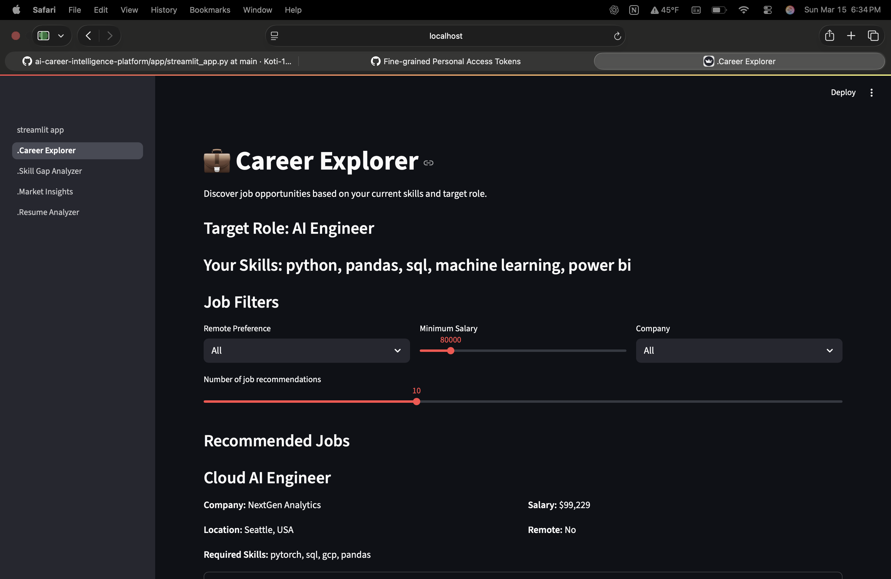
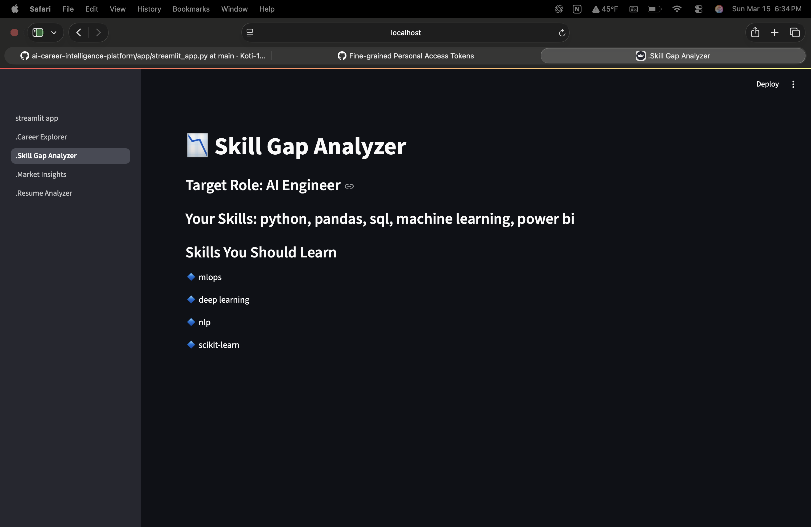
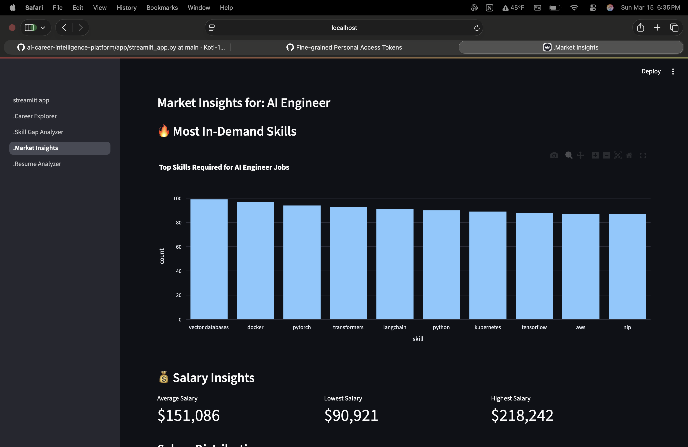

# AI Career Intelligence Platform

An AI-powered platform that helps users explore AI and data career opportunities by analyzing job postings, recommending jobs, identifying skill gaps, and visualizing job market insights.

---

## Features

### Career Explorer
Discover job opportunities that match your skills using an AI-powered recommendation system.

### Skill Gap Analyzer
Identify missing skills required for your target career role.

### Market Insights
Explore trends in job demand, salary distribution, and top companies hiring.

### Resume Skill Analyzer
Upload your resume and automatically extract relevant skills.

---

## Tech Stack

Python  
Streamlit  
Pandas  
Plotly  
Scikit-learn  
Sentence Transformers  

---

## System Architecture

Resume → Skill Extraction → Career Profile → Job Recommendation → Skill Gap Analysis → Market Insights

---
## Platform Screenshots

### Home Page

### Career Explorer

### Skill Gap Analyzer

### Market Insights

## Example Workflow

1. Upload resume  
2. Extract skills automatically  
3. Discover job recommendations  
4. Analyze missing skills  
5. Explore salary and job market insights  

---

## Future Improvements

- Advanced NLP skill extraction
- Semantic job search with vector databases
- Personalized learning roadmap
